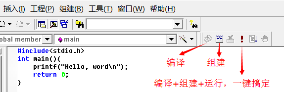

华侨大学（以下简称HQU)作为一个双非院校，期末考试比矿大的毕设都难。人家毕设用matlab建模，只有加减乘除。HQU的matlab期末考试还要考积分变换和级数求和、卷积，还要考逻辑控制语句。

HQU的毕设更离谱，当时都没学过Python,毕设就让做一个图片验证码识别的模型，当时还买了个显卡跑了一下，21年显卡正贵呢。也是当时我不懂取巧，还不如从github上粘一段代码，小程序直接用百度文字识别api呢。

像电磁场、高频、微波、大物……很多课，期末考试挂科的比不挂科的都多。**你说一个双非院校，既给不了学生的求职竞争力，也给不了一个美好的校园生活。**

竞赛也是，一年只有两场专业竞赛，一场是校内自己办的"光微"，一场是ti杯中国大学生电子设计竞赛。后者的难度大家都知道。**像"蓝桥杯""恩智浦杯"等这种赛事，含金量高，也不像ti杯那么难，都不参加，也不跟我们说。**平时的课业负担把人要压死，我还不如大三那年闹退学的时候直接退了呢。

**互联网+、创青春这些比赛，没有境外生的团队都拿不了奖。**

hqu你不服你就把去年的电子信息类的期末试卷拿出来在网上公开公开，让全网学这个专业的人都看看这个难度，让大家评评理

hqu的信息工程那么难学，还没有一个末流二本的计算机好就业

**当年就是被食堂饭好吃、宿舍有空调吸引过去的，我真是目光短浅。**

本来以为矿大只是211,结果一搜还是985，更生气了。

**现在HQU宿舍条件也不如原来好了，四人间改六人间，还不如原本就是六人间的学校呢，因为挤呀，宿舍6个人两张桌子。**

期末考试那么难，可你老师的教学质量那么差，上课为了尊重老师全靠毅力死撑着，啥都听不懂。也不知道是老师教学水平就那样还是故意不给我们讲明白。

我就不举例专业必修课了，不是这个专业的也看不出老师的讲课水平。就举个C语言的例子，这个课是理工科差不多都要学的吧？华大C语言是刘老师讲的（不点名华大的理工科学生基本都知道），人家浙大的翁恺老师十分钟就讲明白的课，刘老师两个小时都讲不明白，仗着自己是北航的毕业生，经常骂我们笨蛋。课程用的软件是Microsoft Visual C++ 6.0 ，有一次实验课，我演示的时候，直接点的感叹号的那个按钮，他就发火，说我上课没听，他上课不是这么讲的，他上课讲的是先点编译，再点组建，再点运行。我说直接点运行这个感叹号程序也能跑，他就说我顶嘴不尊重老师。

点一个按钮就能完成的事情，为什么要点三个按钮？我尊重你上课听你两个小时讲不明白的课？人家翁老师两个小时就把半个学期的课都讲完了，你第一次课两个小时连个变量都没讲明白。

在这里要感谢翁恺老师，要不是翁老师，我这辈子就跟计算机编程绝缘了。现在虽然没工作，但给社区居委会修个电脑修个打印机，接接闲鱼上的小项目也是能赚点零花钱的。并且还能产出一些教程。万分感谢浙大翁老师，感谢您的免费网课。

惭愧的是现在git还没学会，只会搜项目，再git clone。现在能开始产出一些东西了，打算在廖雪峰的站https://www.liaoxuefeng.com/wiki学一学如何git push。

目前是可能是卡在key这里了，push不上去，我好像智商确实比较低。

哈哈，好像是学会了，我现在研究怎么把适用于国内gpu云服务器stable diffusion webui 项目传上去。是部署好了，就是目录比较大
